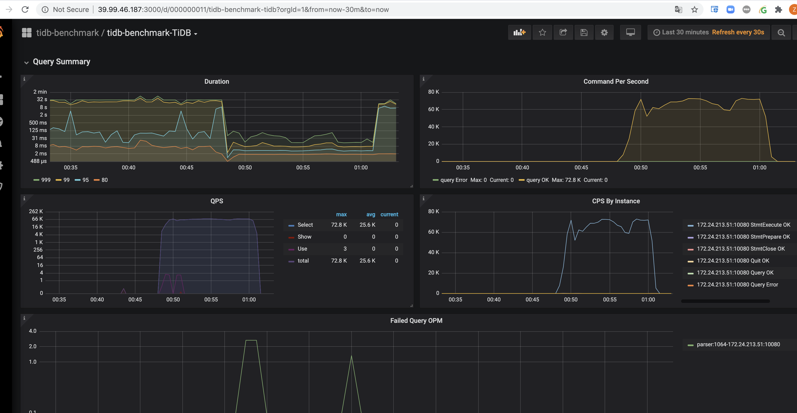

Week 2 TiDB 基准测试
### 机器环境
阿里云机器，3 台 `ecs.c6.xlarge` 用于 PD, 3 台 `ecs.hfg6.2xlarge` 用于 tikv, 1 台 `ecs.c6.2xlarge` 用于 tidb, 1 台 `ecs.hfg6.2xlarge` 用于 benchmark client, 最后 ycsb, tpc 实验时机器换个一次，所以 tikv ip 会不同
|   | cpu  | memory  |  disk | ip  |
|---|---|---|---|---|
|  pd1 | 4  |  8G |  20G | 172.24.213.46  |
| pd2  |  4 |  8G | 20G  | 172.24.213.45  |
|  pd3 |  4 |  8G | 20G  | 172.24.213.47  |
| tikv1  |  8 |  32G | 100G SSD |  172.24.213.50 |
|  tikv1 | 8  | 32G  |  100G SSD | 172.24.213.48  |
|  tikv1 |  8 | 32G  | 100G SSD  | 172.24.213.49  |
|  tidb |  8 | 16G  | 20G  | 172.24.213.51  |
|  bench | 8 | 32G | 20G  |  172.24.213.52 |

系统均为 ubuntu 18.04
```shell
root@tidb:~# uname -a
Linux tidb 4.15.0-111-generic #112-Ubuntu SMP Thu Jul 9 20:32:34 UTC 2020 x86_64 x86_64 x86_64 GNU/Linux
```
### 搭建服务
#### 1.TiKV 挂载 SSD
阿里云申请了各 100G 的 SSD, 需要格式化成 ext4 并挂载，第一步格式化文件系统
```shell
root@tikv001:~# fdisk -l
Disk /dev/vda: 20 GiB, 21474836480 bytes, 41943040 sectors
Units: sectors of 1 * 512 = 512 bytes
Sector size (logical/physical): 512 bytes / 512 bytes
I/O size (minimum/optimal): 512 bytes / 512 bytes
Disklabel type: dos
Disk identifier: 0xc0f4f2f1

Device     Boot Start      End  Sectors Size Id Type
/dev/vda1  *     2048 41940991 41938944  20G 83 Linux


Disk /dev/vdb: 100 GiB, 107374182400 bytes, 209715200 sectors
Units: sectors of 1 * 512 = 512 bytes
Sector size (logical/physical): 512 bytes / 512 bytes
I/O size (minimum/optimal): 512 bytes / 512 bytes
root@tikv001:~#
root@tikv001:~#
root@tikv001:~# parted -s -a optimal /dev/vdb  mklabel gpt -- mkpart primary ext4 1 -1
root@tikv001:~# mkfs.ext4 /dev/vdb
mke2fs 1.44.1 (24-Mar-2018)
Found a gpt partition table in /dev/vdb
Proceed anyway? (y,N) y
Creating filesystem with 26214400 4k blocks and 6553600 inodes
Filesystem UUID: d7f9666d-4e47-4c2d-b9c2-d44cbc34be75
Superblock backups stored on blocks:
    32768, 98304, 163840, 229376, 294912, 819200, 884736, 1605632, 2654208,
    4096000, 7962624, 11239424, 20480000, 23887872

Allocating group tables: done
Writing inode tables: done
Creating journal (131072 blocks): done
Writing superblocks and filesystem accounting information: done
```
第二步，挂载到 /tidb-data, 三台 tikv 机器重复这两步
```shell
root@tikv001:~# lsblk -f
NAME   FSTYPE LABEL UUID                                 MOUNTPOINT
vda
└─vda1 ext4   /     3d375280-1ab5-4559-a895-845bc4cb23c0 /
vdb    ext4         d7f9666d-4e47-4c2d-b9c2-d44cbc34be7
root@tikv001:~# echo "UUID=d7f9666d-4e47-4c2d-b9c2-d44cbc34be75 /tidb-data ext4 defaults,nodelalloc,noatime 0 2" >> /etc/fstab
root@tikv001:~# cat /etc/fstab
# /etc/fstab: static file system information.
#
# Use 'blkid' to print the universally unique identifier for a
# device; this may be used with UUID= as a more robust way to name devices
# that works even if disks are added and removed. See fstab(5).
#
# <file system> <mount point>   <type>  <options>       <dump>  <pass>
# / was on /dev/vda1 during installation
UUID=3d375280-1ab5-4559-a895-845bc4cb23c0 /               ext4    errors=remount-ro 0       1
/dev/fd0        /media/floppy0  auto    rw,user,noauto,exec,utf8 0       0
UUID=d7f9666d-4e47-4c2d-b9c2-d44cbc34be75 /tidb-data ext4 defaults,nodelalloc,noatime 0 2
root@tikv001:~# mkdir /tidb-data
root@tikv001:~# mount -a
```
查看挂载情况
```shell
root@tikv001:~# mount -t ext4
/dev/vda1 on / type ext4 (rw,relatime,errors=remount-ro,data=ordered)
/dev/vdb on /tidb-data type ext4 (rw,noatime,nodelalloc,data=ordered)
root@tikv001:~# df -h
Filesystem      Size  Used Avail Use% Mounted on
udev             16G     0   16G   0% /dev
tmpfs           3.1G  4.0M  3.1G   1% /run
/dev/vda1        20G  3.2G   16G  17% /
tmpfs            16G     0   16G   0% /dev/shm
tmpfs           5.0M     0  5.0M   0% /run/lock
tmpfs            16G     0   16G   0% /sys/fs/cgroup
tmpfs           3.1G     0  3.1G   0% /run/user/0
/dev/vdb         98G   61M   93G   1% /tidb-data
```
#### 2.Tiup 下载安装
```shell
root@tidb:~# curl --proto '=https' --tlsv1.2 -sSf https://tiup-mirrors.pingcap.com/install.sh | sh
  % Total    % Received % Xferd  Average Speed   Time    Time     Time  Current
                                 Dload  Upload   Total   Spent    Left  Speed
100 4422k  100 4422k    0     0  4735k      0 --:--:-- --:--:-- --:--:-- 4730k
WARN: adding root certificate via internet: https://tiup-mirrors.pingcap.com/root.json
You can revoke this by remove /root/.tiup/bin/7b8e153f2e2d0928.root.json
Set mirror to https://tiup-mirrors.pingcap.com success
Detected shell: bash
Shell profile:  /root/.bashrc
/root/.bashrc has been modified to to add tiup to PATH
open a new terminal or source /root/.bashrc to use it
Installed path: /root/.tiup/bin/tiup
===============================================
Have a try:     tiup playground
===============================================
root@tidb:~# source /root/.bashrc
```
#### 3.Tiup 启动集群
从官网下载好 `topology.yaml` 模版，编辑填写正确的 ip 地址
```shell
root@tidb:~# tiup cluster deploy tidb-benchmark nightly ./topology.yaml --user root -p
The component `cluster` is not installed; downloading from repository.
download https://tiup-mirrors.pingcap.com/cluster-v1.0.9-linux-amd64.tar.gz 9.86 MiB / 9.86 MiB 100.00% ? p/s
Starting component `cluster`: /root/.tiup/components/cluster/v1.0.9/tiup-cluster deploy tidb-benchmark nightly ./topology.yaml --user root -p
Please confirm your topology:
tidb Cluster: tidb-benchmark
tidb Version: nightly
Type          Host           Ports        OS/Arch       Directories
----          ----           -----        -------       -----------
pd            172.24.213.46  2379/2380    linux/x86_64  /tidb-deploy/pd-2379,/tidb-data/pd-2379
pd            172.24.213.45  2379/2380    linux/x86_64  /tidb-deploy/pd-2379,/tidb-data/pd-2379
pd            172.24.213.47  2379/2380    linux/x86_64  /tidb-deploy/pd-2379,/tidb-data/pd-2379
tikv          172.24.213.50  20160/20180  linux/x86_64  /tidb-deploy/tikv-20160,/tidb-data/tikv-20160
tikv          172.24.213.48  20160/20180  linux/x86_64  /tidb-deploy/tikv-20160,/tidb-data/tikv-20160
tikv          172.24.213.49  20160/20180  linux/x86_64  /tidb-deploy/tikv-20160,/tidb-data/tikv-20160
tidb          172.24.213.51  4000/10080   linux/x86_64  /tidb-deploy/tidb-4000
prometheus    172.24.213.49  9090         linux/x86_64  /tidb-deploy/prometheus-9090,/tidb-data/prometheus-9090
grafana       172.24.213.48  3000         linux/x86_64  /tidb-deploy/grafana-3000
alertmanager  172.24.213.50  9093/9094    linux/x86_64  /tidb-deploy/alertmanager-9093,/tidb-data/alertmanager-9093
Attention:
    1. If the topology is not what you expected, check your yaml file.
    2. Please confirm there is no port/directory conflicts in same host.
Do you want to continue? [y/N]:  y
+ Generate SSH keys ... Done
+ Download TiDB components
  - Download pd:nightly (linux/amd64) ... Done
  - Download tikv:nightly (linux/amd64) ... Done
  - Download tidb:nightly (linux/amd64) ... Done
  - Download prometheus:nightly (linux/amd64) ... Done
  - Download grafana:nightly (linux/amd64) ... Done
  - Download alertmanager:v0.17.0 (linux/amd64) ... Done
  - Download node_exporter:v0.17.0 (linux/amd64) ... Done
  - Download blackbox_exporter:v0.12.0 (linux/amd64) ... Done
+ Initialize target host environments
  - Prepare 172.24.213.46:22 ... Done
  - Prepare 172.24.213.45:22 ... Done
  - Prepare 172.24.213.47:22 ... Done
  - Prepare 172.24.213.50:22 ... Done
  - Prepare 172.24.213.48:22 ... Done
  - Prepare 172.24.213.49:22 ... Done
  - Prepare 172.24.213.51:22 ... Done
+ Copy files
  - Copy pd -> 172.24.213.46 ... Done
  - Copy pd -> 172.24.213.45 ... Done
  - Copy pd -> 172.24.213.47 ... Done
  - Copy tikv -> 172.24.213.50 ... Done
  - Copy tikv -> 172.24.213.48 ... Done
  - Copy tikv -> 172.24.213.49 ... Done
  - Copy tidb -> 172.24.213.51 ... Done
  - Copy prometheus -> 172.24.213.49 ... Done
  - Copy grafana -> 172.24.213.48 ... Done
  - Copy alertmanager -> 172.24.213.50 ... Done
  - Copy node_exporter -> 172.24.213.49 ... Done
  - Copy node_exporter -> 172.24.213.51 ... Done
  - Copy node_exporter -> 172.24.213.46 ... Done
  - Copy node_exporter -> 172.24.213.45 ... Done
  - Copy node_exporter -> 172.24.213.47 ... Done
  - Copy node_exporter -> 172.24.213.50 ... Done
  - Copy node_exporter -> 172.24.213.48 ... Done
  - Copy blackbox_exporter -> 172.24.213.45 ... Done
  - Copy blackbox_exporter -> 172.24.213.47 ... Done
  - Copy blackbox_exporter -> 172.24.213.50 ... Done
  - Copy blackbox_exporter -> 172.24.213.48 ... Done
  - Copy blackbox_exporter -> 172.24.213.49 ... Done
  - Copy blackbox_exporter -> 172.24.213.51 ... Done
  - Copy blackbox_exporter -> 172.24.213.46 ... Done
+ Check status
Deployed cluster `tidb-benchmark` successfully, you can start the cluster via `tiup cluster start tidb-benchmark`
```
己经安装好 tidb 集群，现在 `tiup cluster start tidb-benchmark` 开始启动
```shell
root@tidb:~# tiup cluster start tidb-benchmark
Starting component `cluster`: /root/.tiup/components/cluster/v1.0.9/tiup-cluster start tidb-benchmark
Starting cluster tidb-benchmark...
+ [ Serial ] - SSHKeySet: privateKey=/root/.tiup/storage/cluster/clusters/tidb-benchmark/ssh/id_rsa, publicKey=/root/.tiup/storage/cluster/clusters/tidb-benchmark/ssh/id_rsa.pub
+ [Parallel] - UserSSH: user=tidb, host=172.24.213.50
+ [Parallel] - UserSSH: user=tidb, host=172.24.213.50
+ [Parallel] - UserSSH: user=tidb, host=172.24.213.49
+ [Parallel] - UserSSH: user=tidb, host=172.24.213.46
+ [Parallel] - UserSSH: user=tidb, host=172.24.213.48
+ [Parallel] - UserSSH: user=tidb, host=172.24.213.49
+ [Parallel] - UserSSH: user=tidb, host=172.24.213.48
+ [Parallel] - UserSSH: user=tidb, host=172.24.213.47
+ [Parallel] - UserSSH: user=tidb, host=172.24.213.45
+ [Parallel] - UserSSH: user=tidb, host=172.24.213.51
+ [ Serial ] - StartCluster
Starting component pd
    Starting instance pd 172.24.213.47:2379
    Starting instance pd 172.24.213.45:2379
    Starting instance pd 172.24.213.46:2379
    Start pd 172.24.213.46:2379 success
    Start pd 172.24.213.45:2379 success
    Start pd 172.24.213.47:2379 success
Starting component node_exporter
    Starting instance 172.24.213.46
    Start 172.24.213.46 success
Starting component blackbox_exporter
    Starting instance 172.24.213.46
    Start 172.24.213.46 success
Starting component node_exporter
    Starting instance 172.24.213.45
    Start 172.24.213.45 success
Starting component blackbox_exporter
    Starting instance 172.24.213.45
    Start 172.24.213.45 success
Starting component node_exporter
    Starting instance 172.24.213.47
    Start 172.24.213.47 success
Starting component blackbox_exporter
    Starting instance 172.24.213.47
    Start 172.24.213.47 success
Starting component tikv
    Starting instance tikv 172.24.213.49:20160
    Starting instance tikv 172.24.213.50:20160
    Starting instance tikv 172.24.213.48:20160
    Start tikv 172.24.213.50:20160 success
    Start tikv 172.24.213.49:20160 success
    Start tikv 172.24.213.48:20160 success
Starting component node_exporter
    Starting instance 172.24.213.50
    Start 172.24.213.50 success
Starting component blackbox_exporter
    Starting instance 172.24.213.50
    Start 172.24.213.50 success
Starting component node_exporter
    Starting instance 172.24.213.48
    Start 172.24.213.48 success
Starting component blackbox_exporter
    Starting instance 172.24.213.48
    Start 172.24.213.48 success
Starting component node_exporter
    Starting instance 172.24.213.49
    Start 172.24.213.49 success
Starting component blackbox_exporter
    Starting instance 172.24.213.49
    Start 172.24.213.49 success
Starting component tidb
    Starting instance tidb 172.24.213.51:4000
    Start tidb 172.24.213.51:4000 success
Starting component node_exporter
    Starting instance 172.24.213.51
    Start 172.24.213.51 success
Starting component blackbox_exporter
    Starting instance 172.24.213.51
    Start 172.24.213.51 success
Starting component prometheus
    Starting instance prometheus 172.24.213.49:9090
    Start prometheus 172.24.213.49:9090 success
Starting component grafana
    Starting instance grafana 172.24.213.48:3000
    Start grafana 172.24.213.48:3000 success
Starting component alertmanager
    Starting instance alertmanager 172.24.213.50:9093
    Start alertmanager 172.24.213.50:9093 success
+ [ Serial ] - UpdateTopology: cluster=tidb-benchmark
Started cluster `tidb-benchmark` successfully
```
测试创建一下 mysql 数据库
```shell
root@tidb:~# tiup cluster display tidb-benchmark
Starting component `cluster`: /root/.tiup/components/cluster/v1.0.9/tiup-cluster display tidb-benchmark
tidb Cluster: tidb-benchmark
tidb Version: nightly
ID                   Role          Host           Ports        OS/Arch       Status  Data Dir                      Deploy Dir
--                   ----          ----           -----        -------       ------  --------                      ----------
172.24.213.50:9093   alertmanager  172.24.213.50  9093/9094    linux/x86_64  Up      /tidb-data/alertmanager-9093  /tidb-deploy/alertmanager-9093
172.24.213.48:3000   grafana       172.24.213.48  3000         linux/x86_64  Up      -                             /tidb-deploy/grafana-3000
172.24.213.45:2379   pd            172.24.213.45  2379/2380    linux/x86_64  Up|L    /tidb-data/pd-2379            /tidb-deploy/pd-2379
172.24.213.46:2379   pd            172.24.213.46  2379/2380    linux/x86_64  Up|UI   /tidb-data/pd-2379            /tidb-deploy/pd-2379
172.24.213.47:2379   pd            172.24.213.47  2379/2380    linux/x86_64  Up      /tidb-data/pd-2379            /tidb-deploy/pd-2379
172.24.213.49:9090   prometheus    172.24.213.49  9090         linux/x86_64  Up      /tidb-data/prometheus-9090    /tidb-deploy/prometheus-9090
172.24.213.51:4000   tidb          172.24.213.51  4000/10080   linux/x86_64  Up      -                             /tidb-deploy/tidb-4000
172.24.213.48:20160  tikv          172.24.213.48  20160/20180  linux/x86_64  Up      /tidb-data/tikv-20160         /tidb-deploy/tikv-20160
172.24.213.49:20160  tikv          172.24.213.49  20160/20180  linux/x86_64  Up      /tidb-data/tikv-20160         /tidb-deploy/tikv-20160
172.24.213.50:20160  tikv          172.24.213.50  20160/20180  linux/x86_64  Up      /tidb-data/tikv-20160         /tidb-deploy/tikv-20160
root@tidb:~# mysql -uroot -h172.24.213.51 -P 4000
Welcome to the MySQL monitor.  Commands end with ; or \g.
Your MySQL connection id is 2
Server version: 5.7.25-TiDB-v4.0.0-beta.2-1016-gf5fa3e7aa TiDB Server (Apache License 2.0) Community Edition, MySQL 5.7 compatible

Copyright (c) 2000, 2020, Oracle and/or its affiliates. All rights reserved.

Oracle is a registered trademark of Oracle Corporation and/or its
affiliates. Other names may be trademarks of their respective
owners.

Type 'help;' or '\h' for help. Type '\c' to clear the current input statement.

mysql> use test;
Database changed
mysql> create table a (a int, b int, c int);
Query OK, 0 rows affected (0.07 sec)

mysql> insert into a values (1,1,1);
Query OK, 1 row affected (0.01 sec)

mysql> insert into a values (2,2,2);
Query OK, 1 row affected (0.00 sec)

mysql> select * from a;
+------+------+------+
| a    | b    | c    |
+------+------+------+
|    1 |    1 |    1 |
|    2 |    2 |    2 |
+------+------+------+
2 rows in set (0.00 sec)
```
#### 4.查看 dashboard
打开网址 `http://39.99.45.157:2379/dashboard/#/statement` 查看

这里有两个问题：
* 阿里云专有网络默认是不把内网端口对外开放的，需要重新设置安全组，把 2379 端口暴露出去，并重启阿里云才能用公网 ip 访问内网 dashboard
* dashboard 的网址是 http://xxxxx:2379/dashboard, 一定要加上 `dashboard` 才可以
### 调整 TiDB TiKV 配置
测试机整体核数不高，均不超过 8 核，所以使用默认配置
### sysbench 压测
#### 1. 安装 sysbench
```shell
root@bench:~# curl -s https://packagecloud.io/install/repositories/akopytov/sysbench/script.deb.sh | sudo bash
Detected operating system as Ubuntu/bionic.
Checking for curl...
Detected curl...
Checking for gpg...
Detected gpg...
Running apt-get update... done.
Installing apt-transport-https... done.
Installing /etc/apt/sources.list.d/akopytov_sysbench.list...done.
Importing packagecloud gpg key... done.
Running apt-get update... done.

The repository is setup! You can now install packages.
root@bench:~# apt install sysbench -y
Reading package lists... Done
Building dependency tree
Reading state information... Done
The following additional packages will be installed:
  libpq5
The following NEW packages will be installed:
  libpq5 sysbench
0 upgraded, 2 newly installed, 0 to remove and 55 not upgraded.
Need to get 444 kB of archives.
After this operation, 1469 kB of additional disk space will be used.
Get:1 http://mirrors.cloud.aliyuncs.com/ubuntu bionic-updates/main amd64 libpq5 amd64 10.12-0ubuntu0.18.04.1 [107 kB]
Get:2 https://packagecloud.io/akopytov/sysbench/ubuntu bionic/main amd64 sysbench amd64 1.0.20-1 [337 kB]
Fetched 444 kB in 8s (56.8 kB/s)
Selecting previously unselected package libpq5:amd64.
(Reading database ... 110345 files and directories currently installed.)
Preparing to unpack .../libpq5_10.12-0ubuntu0.18.04.1_amd64.deb ...
Unpacking libpq5:amd64 (10.12-0ubuntu0.18.04.1) ...
Selecting previously unselected package sysbench.
Preparing to unpack .../sysbench_1.0.20-1_amd64.deb ...
Unpacking sysbench (1.0.20-1) ...
Setting up libpq5:amd64 (10.12-0ubuntu0.18.04.1) ...
Setting up sysbench (1.0.20-1) ...
Processing triggers for libc-bin (2.27-3ubuntu1.2) ...
```
另外最好下载 sysbench 源码，因为里面有各种 bench lua 脚本
```shell
root@bench:~# git clone https://github.com/akopytov/sysbench
```
#### 2. 加载压测数据
```shell
root@bench:~# mysql -uroot -h172.24.213.51 -P 4000
mysql> show global variables like '%txn%';
+-----------------------------------+-------------+
| Variable_name                     | Value       |
+-----------------------------------+-------------+
| tidb_disable_txn_auto_retry       | 1           |
| tidb_enable_amend_pessimistic_txn | on          |
| tidb_txn_mode                     | pessimistic |
+-----------------------------------+-------------+
3 rows in set (0.00 sec)

mysql> set global tidb_disable_txn_auto_retry=off;
Query OK, 0 rows affected (0.01 sec)
mysql> set global tidb_txn_mode="optimistic";
Query OK, 0 rows affected (0.01 sec)
```
```shell
root@bench:~# cat sysbench.conf
mysql-host=172.24.213.51
mysql-port=4000
mysql-user=root
mysql-password=
mysql-db=sbtest
time=600
threads=16
report-interval=10
db-driver=mysql

root@bench:~# sysbench --config-file=./sysbench.conf oltp_point_select --tables=32 --table-size=10000000 prepare
sysbench 1.0.20 (using bundled LuaJIT 2.1.0-beta2)

Initializing worker threads...

Creating table 'sbtest6'...
Creating table 'sbtest10'...
Creating table 'sbtest2'...
Creating table 'sbtest4'...Creating table 'sbtest7'...Creating table 'sbtest3'...Creating table 'sbtest5'...Creating table 'sbtest13'...
Creating table 'sbtest9'...
Creating table 'sbtest14'...
Creating table 'sbtest15'...
Creating table 'sbtest16'...
Creating table 'sbtest8'...
Creating table 'sbtest12'...
Creating table 'sbtest11'...
Creating table 'sbtest1'...
Inserting 10000000 records into 'sbtest10'
Inserting 10000000 records into 'sbtest16'
Inserting 10000000 records into 'sbtest3'
Inserting 10000000 records into 'sbtest9'
Inserting 10000000 records into 'sbtest15'
Inserting 10000000 records into 'sbtest6'
Inserting 10000000 records into 'sbtest7'
Inserting 10000000 records into 'sbtest8'
Inserting 10000000 records into 'sbtest14'
Inserting 10000000 records into 'sbtest5'
Inserting 10000000 records into 'sbtest4'
Inserting 10000000 records into 'sbtest11'
Inserting 10000000 records into 'sbtest13'
Inserting 10000000 records into 'sbtest1'
Inserting 10000000 records into 'sbtest2'
Inserting 10000000 records into 'sbtest12'

```
#### 3. 压测及监控图表
point-select 点查
```shell
root@bench:~/sysbench# sysbench --config-file=./sysbench.conf oltp_point_select --tables=32 --table-size=10000000 --threads=128 run
sysbench 1.0.20 (using bundled LuaJIT 2.1.0-beta2)

Running the test with following options:
Number of threads: 128
Report intermediate results every 10 second(s)
Initializing random number generator from current time
......
[ 590s ] thds: 128 tps: 66707.14 qps: 66707.14 (r/w/o: 66707.14/0.00/0.00) lat (ms,95%): 3.89 err/s: 0.00 reconn/s: 0.00
[ 600s ] thds: 128 tps: 71258.12 qps: 71258.12 (r/w/o: 71258.12/0.00/0.00) lat (ms,95%): 3.55 err/s: 0.00 reconn/s: 0.00
SQL statistics:
    queries performed:
        read:                            40883434
        write:                           0
        other:                           0
        total:                           40883434
    transactions:                        40883434 (68136.56 per sec.)
    queries:                             40883434 (68136.56 per sec.)
    ignored errors:                      0      (0.00 per sec.)
    reconnects:                          0      (0.00 per sec.)

General statistics:
    total time:                          600.0207s
    total number of events:              40883434

Latency (ms):
         min:                                    0.26
         avg:                                    1.88
         max:                                  375.98
         95th percentile:                        3.75
         sum:                             76786735.85

Threads fairness:
    events (avg/stddev):           319401.8281/653.36
    execution time (avg/stddev):   599.8964/0.00
```



update-index 索引更新
```shell
root@bench:~/sysbench# sysbench --config-file=./sysbench.conf oltp_update_index --tables=32 --table-size=10000000 --threads=128 run
sysbench 1.0.20 (using bundled LuaJIT 2.1.0-beta2)

Running the test with following options:
Number of threads: 128
Report intermediate results every 10 second(s)
Initializing random number generator from current time


Initializing worker threads...

Threads started!

......
[ 560s ] thds: 128 tps: 7096.30 qps: 7096.30 (r/w/o: 0.00/6966.10/130.20) lat (ms,95%): 48.34 err/s: 0.00 reconn/s: 0.00
[ 570s ] thds: 128 tps: 7348.40 qps: 7348.40 (r/w/o: 0.00/7219.20/129.20) lat (ms,95%): 27.66 err/s: 0.00 reconn/s: 0.00
[ 580s ] thds: 128 tps: 7191.00 qps: 7191.00 (r/w/o: 0.00/7054.30/136.70) lat (ms,95%): 47.47 err/s: 0.00 reconn/s: 0.00
[ 590s ] thds: 128 tps: 6820.70 qps: 6820.70 (r/w/o: 0.00/6694.90/125.80) lat (ms,95%): 53.85 err/s: 0.00 reconn/s: 0.00
[ 600s ] thds: 128 tps: 7490.78 qps: 7490.78 (r/w/o: 0.00/7349.48/141.30) lat (ms,95%): 40.37 err/s: 0.00 reconn/s: 0.00
SQL statistics:
    queries performed:
        read:                            0
        write:                           3672179
        other:                           68732
        total:                           3740911
    transactions:                        3740911 (6234.64 per sec.)
    queries:                             3740911 (6234.64 per sec.)
    ignored errors:                      0      (0.00 per sec.)
    reconnects:                          0      (0.00 per sec.)

General statistics:
    total time:                          600.0191s
    total number of events:              3740911

Latency (ms):
         min:                                    0.51
         avg:                                   20.53
         max:                                 3831.73
         95th percentile:                       65.65
         sum:                             76799692.34

Threads fairness:
    events (avg/stddev):           29225.8672/76.00
    execution time (avg/stddev):   599.9976/0.01
```


### go-ycsb 压测
#### 1. 安装 go-ycsb
```shell
root@bench:~# git clone https://github.com/pingcap/go-ycsb
root@bench:~# cd go-ycsb
root@bench:~/go-ycsb# GOPROXY=https://goproxy.cn make
go build -o bin/go-ycsb cmd/go-ycsb/*
go: downloading github.com/spf13/cobra v0.0.3
go: downloading github.com/magiconair/properties v1.8.0
go: downloading cloud.google.com/go v0.49.0
......

go: downloading github.com/alecthomas/template v0.0.0-20160405071501-a0175ee3bccc
go: downloading github.com/gogo/protobuf v1.2.0
go: downloading github.com/golang/groupcache v0.0.0-20191027212112-611e8accdfc9
go: downloading golang.org/x/oauth2 v0.0.0-20191202225959-858c2ad4c8b6
go: downloading github.com/google/go-cmp v0.3.1
root@bench:~/go-ycsb# ls
Dockerfile  LICENSE  Makefile  README.md  YCSB-LICENSE  bin  cmd  db  fdb-dockerfile  go.mod  go.sum  pkg  tool  workloads
root@bench:~/go-ycsb# ls -rlt bin
total 45028
-rwxr-xr-x 1 root root 46105912 Aug 25 22:11 go-ycsb
```
#### 2. 加载压测数据
```shell
root@bench:~/go-ycsb# ./bin/go-ycsb load mysql -P workloads/workloada -p recordcount=100000 -p mysql.host=172.24.213.51 -p mysql.port=4000 --threads 8
***************** properties *****************
"mysql.host"="172.24.213.51"
"dotransactions"="false"
"recordcount"="100000"
"readproportion"="0.5"
"insertproportion"="0"
"scanproportion"="0"
"threadcount"="8"
"updateproportion"="0.5"
"readallfields"="true"
"mysql.port"="4000"
"requestdistribution"="uniform"
"operationcount"="1000"
"workload"="core"
**********************************************
INSERT - Takes(s): 10.0, Count: 9822, OPS: 983.3, Avg(us): 8110, Min(us): 3941, Max(us): 50334, 99th(us): 49000, 99.9th(us): 50000, 99.99th(us): 51000
INSERT - Takes(s): 20.0, Count: 19608, OPS: 980.9, Avg(us): 8132, Min(us): 3941, Max(us): 51169, 99th(us): 49000, 99.9th(us): 50000, 99.99th(us): 52000
INSERT - Takes(s): 30.0, Count: 29403, OPS: 980.5, Avg(us): 8137, Min(us): 3941, Max(us): 52673, 99th(us): 49000, 99.9th(us): 50000, 99.99th(us): 53000
INSERT - Takes(s): 40.0, Count: 39179, OPS: 979.7, Avg(us): 8144, Min(us): 3941, Max(us): 52673, 99th(us): 49000, 99.9th(us): 50000, 99.99th(us): 53000
INSERT - Takes(s): 50.0, Count: 48977, OPS: 979.8, Avg(us): 8144, Min(us): 3941, Max(us): 52673, 99th(us): 49000, 99.9th(us): 50000, 99.99th(us): 53000
INSERT - Takes(s): 60.0, Count: 58738, OPS: 979.1, Avg(us): 8149, Min(us): 3916, Max(us): 55127, 99th(us): 49000, 99.9th(us): 51000, 99.99th(us): 55000
^@INSERT - Takes(s): 70.0, Count: 68526, OPS: 979.1, Avg(us): 8150, Min(us): 3916, Max(us): 55127, 99th(us): 49000, 99.9th(us): 50000, 99.99th(us): 55000
INSERT - Takes(s): 80.0, Count: 78275, OPS: 978.6, Avg(us): 8154, Min(us): 3916, Max(us): 57803, 99th(us): 50000, 99.9th(us): 51000, 99.99th(us): 57000
INSERT - Takes(s): 90.0, Count: 88004, OPS: 977.9, Avg(us): 8160, Min(us): 3849, Max(us): 57803, 99th(us): 50000, 99.9th(us): 51000, 99.99th(us): 56000
INSERT - Takes(s): 100.0, Count: 97685, OPS: 977.0, Avg(us): 8168, Min(us): 3605, Max(us): 57803, 99th(us): 50000, 99.9th(us): 51000, 99.99th(us): 56000
INSERT - Takes(s): 110.0, Count: 100000, OPS: 909.2, Avg(us): 8205, Min(us): 3605, Max(us): 57803, 99th(us): 50000, 99.9th(us): 54000, 99.99th(us): 57000
Run finished, takes 1m53.857819114s
INSERT - Takes(s): 113.8, Count: 100000, OPS: 878.4, Avg(us): 8205, Min(us): 3605, Max(us): 57803, 99th(us): 50000, 99.9th(us): 54000, 99.99th(us): 57000
```
#### 3. 压测及监控图表
```shell
root@bench:~/go-ycsb# ./bin/go-ycsb run mysql -P workloads/workloada -p operationcount=1000000 -p mysql.host=172.24.213.51 -p mysql.port=4000 --threads 256
***************** properties *****************
"workload"="core"
"insertproportion"="0"
"scanproportion"="0"
"readproportion"="0.5"
"updateproportion"="0.5"
"mysql.host"="172.24.213.53"
"mysql.port"="4000"
"operationcount"="1000000"
"readallfields"="true"
"requestdistribution"="uniform"
"recordcount"="1000"
"threadcount"="256"
"dotransactions"="true"
**********************************************
READ   - Takes(s): 10.0, Count: 56842, OPS: 5685.8, Avg(us): 4009, Min(us): 676, Max(us): 496705, 99th(us): 22000, 99.9th(us): 81000, 99.99th(us): 398000
UPDATE - Takes(s): 10.0, Count: 56080, OPS: 5627.5, Avg(us): 40528, Min(us): 6314, Max(us): 1090589, 99th(us): 406000, 99.9th(us): 900000, 99.99th(us): 1062000

......
UPDATE - Takes(s): 90.0, Count: 476930, OPS: 5301.2, Avg(us): 44175, Min(us): 3157, Max(us): 3116509, 99th(us): 288000, 99.9th(us): 865000, 99.99th(us): 1297000
Run finished, takes 1m35.879579602s
READ   - Takes(s): 95.9, Count: 501309, OPS: 5228.7, Avg(us): 3904, Min(us): 671, Max(us): 786810, 99th(us): 45000, 99.9th(us): 81000, 99.99th(us): 483000
UPDATE - Takes(s): 95.8, Count: 498627, OPS: 5202.4, Avg(us): 43745, Min(us): 3157, Max(us): 3116509, 99th(us): 286000, 99.9th(us): 863000, 99.99th(us): 1302000
```


### go-tpc 压测
#### 1. 安装 go-tpc
```shell
root@bench:~# git clone https://github.com/pingcap/go-tpc
root@bench:~# cd go-tpc/
root@bench:~/go-tpc# ls
LICENSE  Makefile  README.md  ch  cmd  docs  go.mod  go.sum  install.sh  pkg  tpcc  tpch
root@bench:~/go-tpc# GOPROXY=https://goproxy.cn make build
go mod tidy
GO111MODULE=on go mod tidy
go: downloading google.golang.org/appengine v1.6.2
go: downloading github.com/spf13/cobra v0.0.5
go: downloading github.com/inconshreveable/mousetrap v1.0.0
go build -o ./bin/go-tpc cmd/go-tpc/*
```
#### 2. 加载压测数据
加载 tpcc
```shell
root@bench:~/go-tpc# ./bin/go-tpc tpcc -H 172.24.213.51 -P 4000 -D tpcc --warehouses 10 prepare
creating table warehouse
creating table district
creating table customer
creating table history
creating table new_order
creating table orders
creating table order_line
creating table stock
creating table item
load to item
load to warehouse in warehouse 1
load to stock in warehouse 1

......
begin to check warehouse 10 at condition 3.3.2.5
begin to check warehouse 10 at condition 3.3.2.6
begin to check warehouse 10 at condition 3.3.2.7
begin to check warehouse 10 at condition 3.3.2.8
begin to check warehouse 10 at condition 3.3.2.11
begin to check warehouse 10 at condition 3.3.2.2
Finished
```
加载 tpch
```shell
root@bench:~/go-tpc# ./bin/go-tpc tpch prepare -H 172.24.213.51 -P 4000 -D tpch --sf4 --analyze
```
#### 3. 压测及监控图表
压测 tpcc
```shell
root@bench:~/go-tpc# ./bin/go-tpc tpcc -H 172.24.213.51 -P 4000 -D tpcc --warehouses 10 run --time 5m --threads 256
[Current] DELIVERY - Takes(s): 9.2, Count: 136, TPM: 891.1, Sum(ms): 49236, Avg(ms): 362, 90th(ms): 1000, 99th(ms): 1500, 99.9th(ms): 1500
[Current] NEW_ORDER - Takes(s): 9.3, Count: 1634, TPM: 10504.4, Sum(ms): 925377, Avg(ms): 566, 90th(ms): 1500, 99th(ms): 2000, 99.9th(ms): 4000
[Current] ORDER_STATUS - Takes(s): 9.4, Count: 152, TPM: 973.7, Sum(ms): 1212, Avg(ms): 7, 90th(ms): 8, 99th(ms): 80, 99.9th(ms): 112
[Current] PAYMENT - Takes(s): 9.3, Count: 1515, TPM: 9723.4, Sum(ms): 1291073, Avg(ms): 852, 90th(ms): 2000, 99th(ms): 4000, 99.9th(ms): 4000

......
[Current] ORDER_STATUS - Takes(s): 9.9, Count: 178, TPM: 1073.9, Sum(ms): 1082, Avg(ms): 6, 90th(ms): 8, 99th(ms): 48, 99.9th(ms): 64
[Current] PAYMENT - Takes(s): 10.0, Count: 1655, TPM: 9970.2, Sum(ms): 1448405, Avg(ms): 875, 90th(ms): 2000, 99th(ms): 4000, 99.9th(ms): 4000
[Current] STOCK_LEVEL - Takes(s): 10.0, Count: 163, TPM: 980.8, Sum(ms): 1622, Avg(ms): 9, 90th(ms): 12, 99th(ms): 80, 99.9th(ms): 80
Finished
[Summary] DELIVERY - Takes(s): 299.2, Count: 4436, TPM: 889.6, Sum(ms): 1571335, Avg(ms): 354, 90th(ms): 1000, 99th(ms): 1500, 99.9th(ms): 4000
[Summary] NEW_ORDER - Takes(s): 299.4, Count: 51263, TPM: 10274.0, Sum(ms): 31718958, Avg(ms): 618, 90th(ms): 2000, 99th(ms): 4000, 99.9th(ms): 8000
[Summary] NEW_ORDER_ERR - Takes(s): 299.4, Count: 93, TPM: 18.6, Sum(ms): 48772, Avg(ms): 524, 90th(ms): 1500, 99th(ms): 1500, 99.9th(ms): 1500
[Summary] ORDER_STATUS - Takes(s): 299.4, Count: 4742, TPM: 950.3, Sum(ms): 27306, Avg(ms): 5, 90th(ms): 8, 99th(ms): 32, 99.9th(ms): 64
[Summary] PAYMENT - Takes(s): 299.4, Count: 49424, TPM: 9904.9, Sum(ms): 43064177, Avg(ms): 871, 90th(ms): 2000, 99th(ms): 4000, 99.9th(ms): 8000
[Summary] PAYMENT_ERR - Takes(s): 299.4, Count: 154, TPM: 30.9, Sum(ms): 87736, Avg(ms): 569, 90th(ms): 1500, 99th(ms): 1500, 99.9th(ms): 2000
[Summary] STOCK_LEVEL - Takes(s): 299.4, Count: 4677, TPM: 937.3, Sum(ms): 55052, Avg(ms): 11, 90th(ms): 16, 99th(ms): 80, 99.9th(ms): 512
tpmC: 10274.0
```


压测 tpch
```shell
root@bench:~/go-tpc# ./bin/go-tpc tpch run -H 172.24.213.51 -P 4000 -D tpch --sf4
```


### 负载分析
N/A
